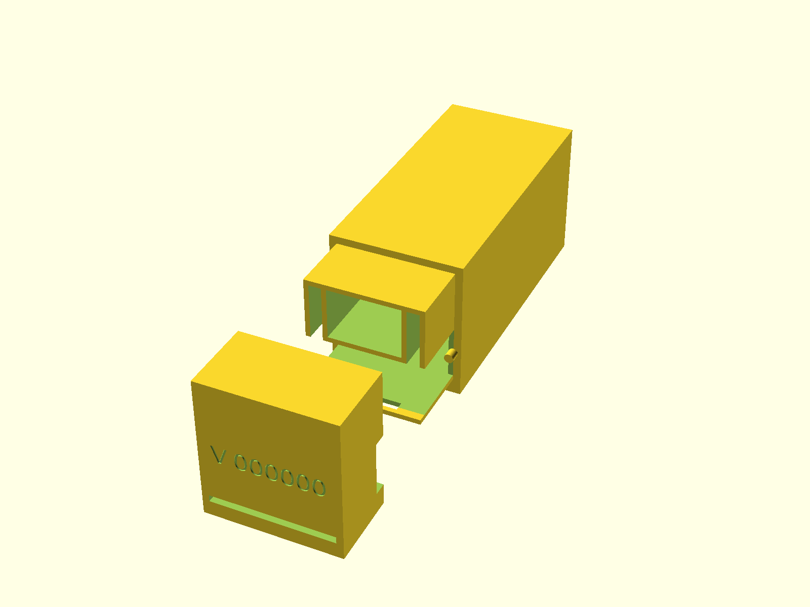

# lockbox-enclosure

This repository is part of the [EKI Lockbox project](https://embeddedkink.com/lockbox). This repository contains the enclosure of the lockbox. It is 3d printed and designed in OpenSCAD.

- The firmware can be found [here](https://github.com/embeddedkink/lockbox-firmware/)
- To install the firmware, you can use [this installer](https://embeddedkink.com/lockbox-firmware/)

Planned changes:

- [ ] Set key compartment size independently from board and pin size
- [ ] Redesign locking mechanism for easier printing
- [ ] Allow picking between power wires or exposing usb connector on the board
- [ ] Allow picking profiles from Makefile
